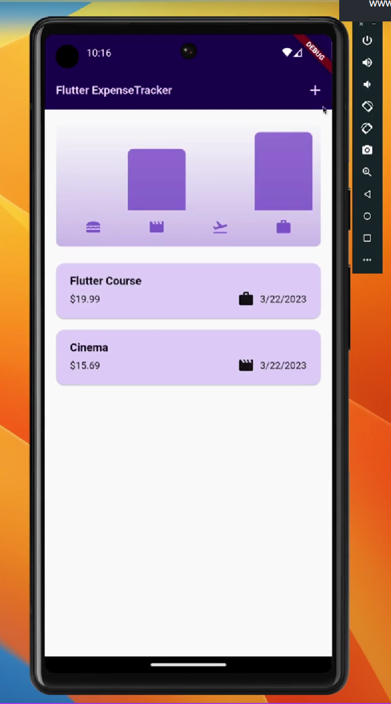
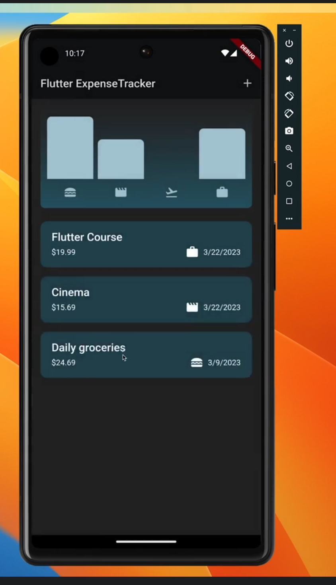
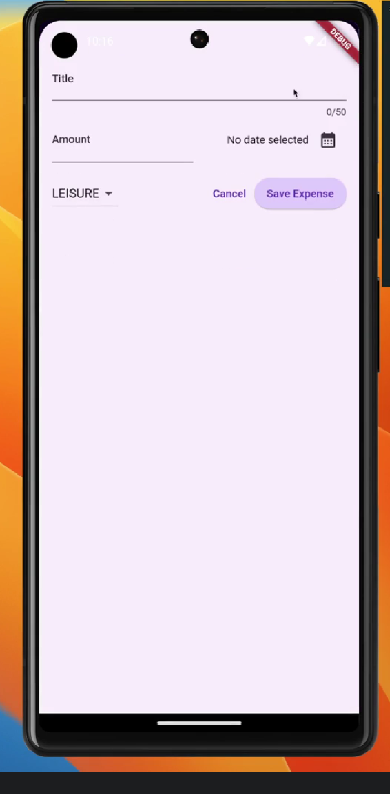

# Expense Tracker

## Project Overview

Expense Tracker is a full-stack mobile application for recording and managing
personal expenses. It demonstrates an end-to-end architecture spanning a
Flutter client, an ASP.NET Core Web API, a lightweight business and data-access
layer, and persistent SQL Server storage.

The project deliberately keeps its scope and abstractions small so the complete
request flow remains easy to understand.

## Key Features

- Loads persisted expenses from SQL Server through the API.
- Creates validated expenses and immediately updates the local list and chart.
- Prevents duplicate create submissions while a request is in progress.
- Orders expenses by newest date, then highest expense ID for equal dates.
- Deletes expenses with a four-second Undo window before permanent deletion.
- Restores an expense locally if the delete request fails.
- Displays category icons and a category-based spending chart.
- Supports the fixed categories Food, Travel, Leisure, and Work.
- Follows the operating system's light or dark appearance.
- Shows initial loading, error, empty, and retry states on Home.

## Tech Stack

| Area | Technology |
| --- | --- |
| Mobile | Flutter, Dart (Android and iOS) |
| Backend | C#, ASP.NET Core Web API, .NET 8 |
| Data access | ADO.NET, Microsoft.Data.SqlClient |
| Database | SQL Server |

## Architecture

```text
Flutter Mobile App
        ↓
    HTTP / JSON
        ↓
ASP.NET Core Web API
        ↓
  Business Layer
        ↓
Data Access Layer
        ↓
      ADO.NET
        ↓
    SQL Server
```

The Flutter client uses a lightweight feature-first structure with UI, feature
state, API request/response types, and app models separated by responsibility.
API responses are mapped into the model consumed by the expense UI.

The backend uses a small layered structure: the API handles HTTP concerns, the
business layer applies validation, and the data-access layer executes
parameterized SQL through ADO.NET. ADO.NET is an intentional choice instead of
EF Core. This is not full Clean Architecture; the project avoids repository,
use-case, and domain layers that its current scope does not require.

## API Endpoints

| Method | Endpoint | Successful response | Other implemented responses |
| --- | --- | --- | --- |
| `GET` | `/api/Expenses` | `200 OK` with the expense list | — |
| `POST` | `/api/Expenses` | `201 Created` with the created expense | `400 Bad Request` for invalid expense data |
| `DELETE` | `/api/Expenses/{expenseId}` | `204 No Content` | `400 Bad Request` for a non-positive ID; `404 Not Found` when no expense has that ID |

Example create request:

```http
POST /api/Expenses
Content-Type: application/json

{
  "title": "Lunch",
  "amount": 24.50,
  "expenseDate": "2025-01-15",
  "categoryCode": "food"
}
```

The development request collection is available in
[`ExpenseTracker.Api.http`](backend/ExpenseTracker/ExpenseTracker.Api/ExpenseTracker.Api.http).

## Database

The initialization script creates SQL Server database `ExpenseTracker` and its
`dbo.Expenses` table.

| Column | Definition |
| --- | --- |
| `ExpenseId` | `INT IDENTITY(1,1) NOT NULL`, primary key |
| `Title` | `NVARCHAR(50) NOT NULL` |
| `Amount` | `DECIMAL(19,2) NOT NULL` |
| `ExpenseDate` | `DATE NOT NULL` |
| `CategoryCode` | `VARCHAR(10) NOT NULL` |

The schema also enforces a nonblank trimmed title, a positive amount, and a
category code of `food`, `travel`, `leisure`, or `work`.

## Delete and Undo Design

```text
Swipe → remove locally → show Undo for 4 seconds
                         ├─ Undo: restore locally; do not call the API
                         └─ Timeout/dismiss: call DELETE and remove from SQL Server
```

Waiting to call the API until the Undo window closes avoids deleting a database
row and recreating it with a different identity ID. If permanent deletion fails,
the client restores the original expense and shows an error.

## Repository Structure

```text
expense-tracker/
├── mobile/                         # Flutter application
├── backend/ExpenseTracker/
│   ├── ExpenseTracker.Api/         # HTTP endpoints and API configuration
│   ├── ExpenseTracker.Business/    # Validation and application logic
│   ├── ExpenseTracker.DataAccess/  # Parameterized ADO.NET operations
│   └── ExpenseTracker.Shared/      # Shared backend expense model
├── database/                       # SQL Server initialization script
└── design_refs/                    # Light, dark, and add-expense references
```

## Screenshots

<table>
  <tr>
    <th>Home — Light</th>
    <th>Home — Dark</th>
    <th>Add Expense</th>
  </tr>
  <tr>
    <td></td>
    <td></td>
    <td></td>
  </tr>
</table>

## Running Locally

Prerequisites: Flutter, the .NET 8 SDK, and a local SQL Server instance.

### 1. Database

Execute [`database/001_initial_schema.sql`](database/001_initial_schema.sql) in
SQL Server. The script creates the `ExpenseTracker` database and
`dbo.Expenses` table.

### 2. Backend

Configure the connection string with .NET User Secrets. The following example
uses local Windows integrated authentication and contains no password:

```bash
dotnet user-secrets set "ConnectionStrings:ExpenseTracker" "Server=localhost;Database=ExpenseTracker;Integrated Security=True;TrustServerCertificate=True;" --project backend/ExpenseTracker/ExpenseTracker.Api/ExpenseTracker.Api.csproj
```

Run the API's HTTP development profile:

```bash
dotnet run --project backend/ExpenseTracker/ExpenseTracker.Api/ExpenseTracker.Api.csproj --launch-profile http
```

This profile listens on `http://localhost:5063`.

### 3. Flutter

From the `mobile/` directory:

```bash
flutter pub get
flutter run --dart-define=API_BASE_URL=http://10.0.2.2:5063
```

Android emulators use `10.0.2.2` to reach the host computer's loopback
interface. `API_BASE_URL` has that address as its development default and can be
overridden with `--dart-define` for another simulator, device, or API host.

## Validation

Run mobile checks from `mobile/`:

```bash
flutter analyze
flutter test
```

Run backend and repository checks from the repository root:

```bash
dotnet build backend/ExpenseTracker/ExpenseTracker.sln
git diff --check
```

The repository does not currently define a CI/CD pipeline.

## Scope and Design Decisions

- Expense amounts are presented in Saudi riyals (`SAR`).
- Categories are currently fixed to Food, Travel, Leisure, and Work.
- Authentication and multiple-user ownership are not implemented.
- Expense editing (`PUT`/`PATCH`) is not implemented.
- ADO.NET is intentionally used instead of EF Core.
- The architecture stays lightweight and grows only with demonstrated needs.

## Future Improvements

- Add expense editing.
- Add authentication and per-user expense ownership.
- Expand automated coverage for mobile and backend behavior.
- Add deployment and production API configuration.
